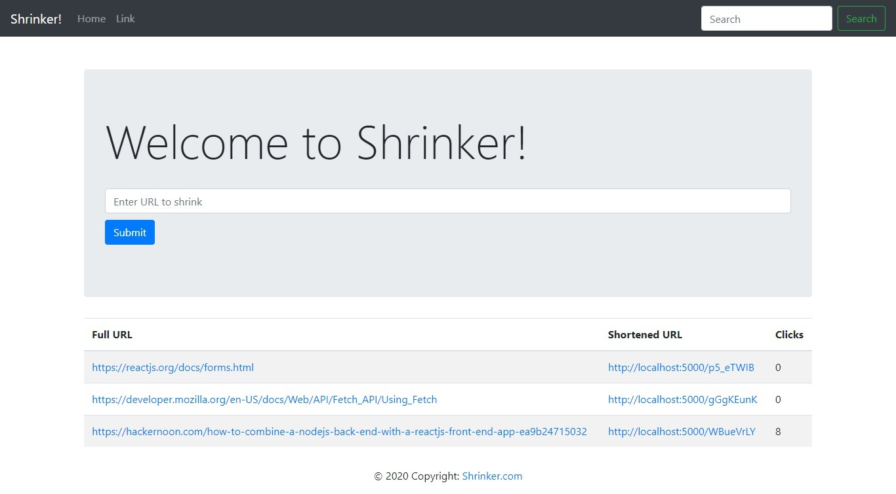

# url-shrinker

A single page URL shrinker made using **React.js** as front-end, **Node.js** as back-end and **MongoDB** as database.
Though this is a much simple implementation, ideally we should use some sort of caching system such as Redis along with some SQL/NoSQL database. This would help in reducing the requests to our main database. Also there should be some load balancer to manage the number of requests received.

## How this works?
When a user types in URL on the home page that is served with React and submits, the Node on the backend assigns a *random id* to the url
and stores it in the MongoDB database. 
So after this whenever the user types in this *id* in the browser prefixed with the domain name of the site, the node logic efficiently routes it to the appropriate url.

## How to run locally?

 1. Clone the project.
 2.  run `npm install` inside root. This will install all dependencies for Backend.
 3. `cd client`. Run `yarn install`. This will install all dependencies for Frontend.
 4. Open two windows, one for root folder and other for client folder. Run `npm start` in both the windows. 
 

## Further tasks

 - Deploy the site
 - Have a option to delete the url.
 - Implement User Authentication.
 - Custom URLs.
 - Many more..
